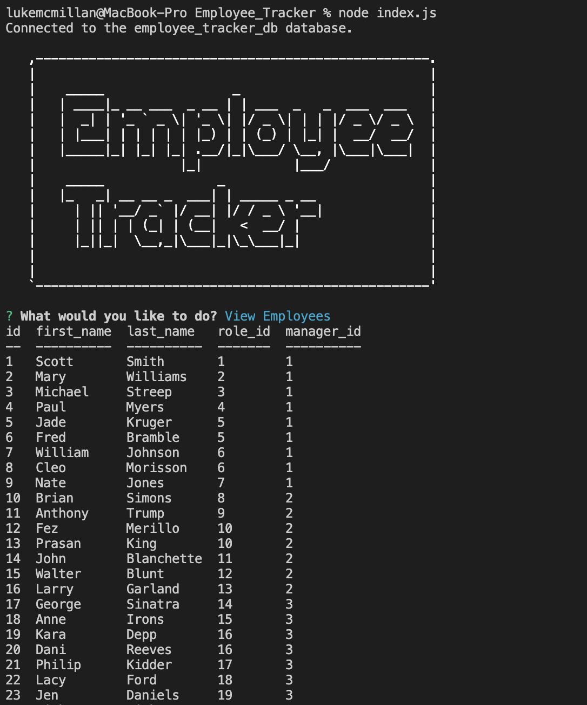

# Employee Tracker

  
  
  ## Description
  This application run on the command-line and allow users to manage departments, roles and employee structure in their company.
  
  ## Table of Contents
  - [Description](#description)
  - [Installation](#installation)
  - [Video](#video&screenshot)
  - [License](#license)
  - [Contributing](#contributing)
  - [Questions](#questions)
  
  ## Installation
  1. clone repository 
  2. run schema and seedDB
  3. NPM I 
  4. Node index.js
  5. Follow prompts.
  
  ## Video&ScreenShot
  Video of application functionality - [video](https://drive.google.com/file/d/1d5YT89DOgxzmXwu25qnQR3hl69AgDB8Y/view?usp=sharing)

  
  ## License
  
  
   
  This application is covered under the MIT license.

  ## Contributing
  Contact Developer

  ## Questions
  Contact the developer if there are any issues.
  
  Find me on GitHub: [Lukemcmi](https://github.com/Lukemcmi)
  